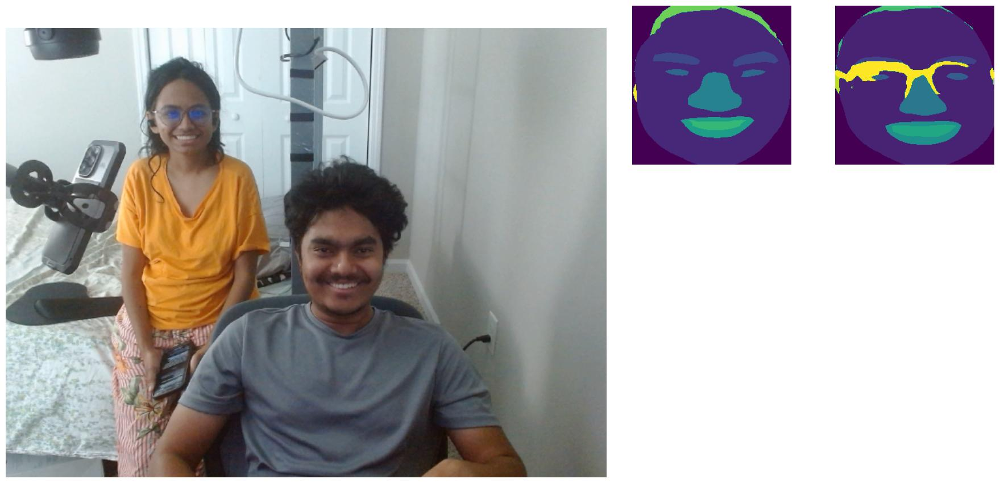

# Extracting facial regions from an image using segmentation

To use this repository, please follow these steps:

- Clone this repository or download as a zip
- Make sure your system has Anaconda installed. Open a terminal to the root directory and enter the following command: "conda env create -f environment.yml". This will create a conda environment with the required libraries.
- After the required libraries have been installed, type "conda activate face_segmentation" in your terminal to activate the newly created environment.
- The model uses trained weights to segment out the facial regions. Download the weights from [here](https://drive.google.com/file/d/1Ig63E4FV_SNM7pz7Hs8nUIw5-91JD5Jo/) and store in `root/models`. These weights were obtained by training a [Multi-Class Face Segmentation](https://www.kaggle.com/datasets/ashish2001/multiclass-face-segmentation) dataset using the [PSPNet](https://arxiv.org/abs/1612.01105). This repository does not go into detail of the training procedure, which consists of a simple dataloader and optimization with respect to a cross-entropy loss function.
- Also download these files [resnet18](https://drive.google.com/file/d/1IMDWoBgIPZ4h012WsXhSHErNHQbC_hEA/view?usp=sharing) and [resnet50](https://drive.google.com/file/d/1MV43aXU99LD8zQcE6qlqKenUaRLfqyCT/view?usp=sharing) and store them in `root/initmodel`.
- The system may also require Haar cascades to detect faces. Find them [here](https://github.com/opencv/opencv/tree/master/data/haarcascades). Store the required files in `.../anaconda3/envs/face_segmentation/Lib/site-packages/data/`. The frontalface_default, profile_face and eye files may be needed.
- The environment now ready. To run the system, use either "segment_regions_full.py" or "segment_regions_isolated.py".
- `python segment_regions_full.py` will use the webcam to show a live feed of segmented facial regions (eyes, lips, skin, nose, etc.) for every person present in the video. Here is a [demo](https://www.youtube.com/watch?v=d72smZw2iCU&ab_channel=ShuvoNewaz) of how this works.
- `python segment_regions_isolated.py` will use the webcam to show a live feed of either the entire image or the face or the selected facial region. The current version works for only one person in the video, but it can be easily extended to include multiple people. Refer to "label_explanation.txt" for the required keys to show facial regions. Here is a [demo](https://www.youtube.com/watch?v=aqq1Y5A9zNA&ab_channel=ShuvoNewaz) of how this works.
- This project uses [**deepface**](https://github.com/serengil/deepface). The face recognition model used will determine the speed/accuracy of the detection. For example, OpenCV is fast, but not as accurate. RetinaFace is accurate, but not as fast.

  

