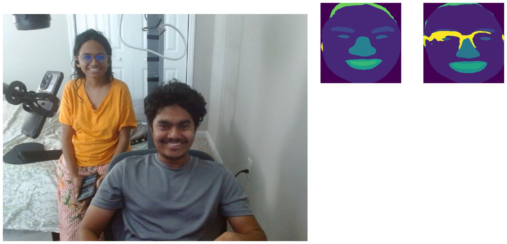

# Extracting facial regions from an image using segmentation

## Environment

To use this repository, please follow these steps:

- Open terminal in your preferred work directory and enter the following commands:

    `git clone https://github.com/ShuvoNewaz/Facial-Region-Segmentation`

    `cd Facial-Region-Segmentation`
- Make sure your system has [Anaconda](https://www.anaconda.com/download) installed. Enter the following command:

    `conda env create -f misc/environment.yml`

  This will create a conda environment with the required libraries. Activate the environment by typing

    `conda activate face_segmentation`
- Edit line 8 of the [downloader](misc/download.sh) as required. To download and organize the dataset and the required pretrained weights, run

    `bash misc/download.sh`
- The environment is now ready. To run the system, use either [segment_regions_full.py](segment_regions_full.py) or [segment_regions_isolated.py](segment_regions_isolated.py).
- `python segment_regions_full.py` will use the webcam to show a live feed of segmented facial regions (eyes, lips, skin, nose, etc.) for every person present in the video. Here is a [demo](https://www.youtube.com/watch?v=d72smZw2iCU&ab_channel=ShuvoNewaz) of how this works.
- `python segment_regions_isolated.py` will use the webcam to show a live feed of either the entire image or the face or the selected facial region. The current version works for only one person in the video, but it can be easily extended to include multiple people. Refer to [this file](misc/label_explanation.txt) for the required keys to show facial regions. Here is a [demo](https://www.youtube.com/watch?v=aqq1Y5A9zNA&ab_channel=ShuvoNewaz) of how this works.
- This project uses [**deepface**](https://github.com/serengil/deepface). The face recognition model used will determine the speed/accuracy of the detection. For example, OpenCV is fast, but not as accurate. RetinaFace is accurate, but not as fast.

## Dataset

The dataset used for training and validation is the [Multi-Class Face Segmentation](https://www.kaggle.com/datasets/ashish2001/multiclass-face-segmentation) dataset. The training and validation set are already separated. The training set has about 20 thousand images with corresponding masks, and the validation set has 2653 images with corresponding masks.

## Training

Running the [downloader](misc/download.sh) downloads a pretrained model that allows bypassing the training process. However, if you wish to train, open the [notebook](notebook.ipynb), activate the installed conda environment, and run all. The downloaded pretrained weights will be replaced by a newly trained set of weights.

  

